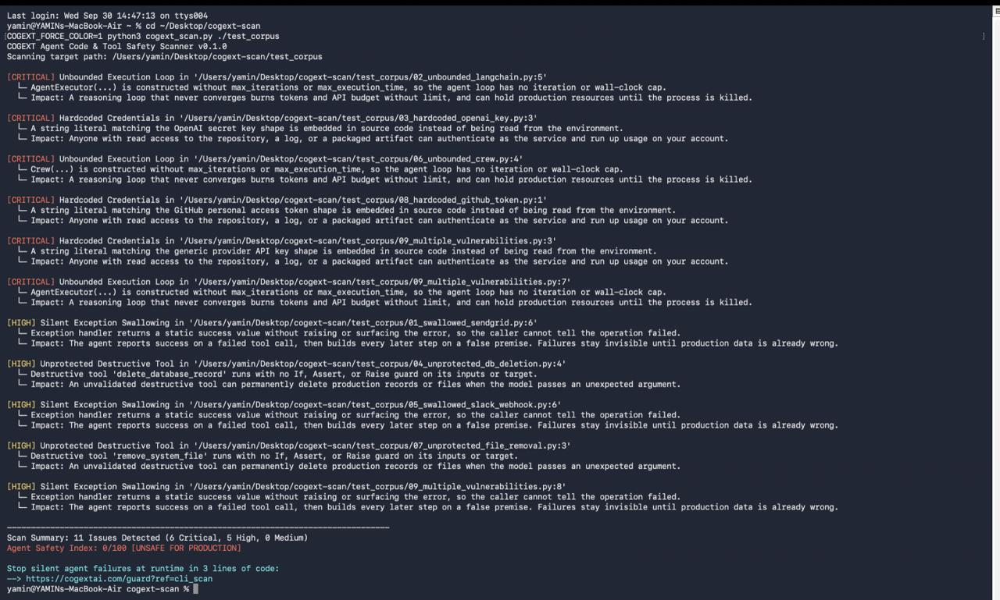

# cogext-scan

Zero-dependency static analysis tool for AI agent code, framework calls, and tool definitions.



## Installation

```bash
pip install cogext-scan
```

## Quickstart

Scan a directory:

```bash
cogext-scan ./src
```

JSON output for CI/CD:

```bash
cogext-scan ./src --json
```

Strict mode (exit code 1 on high or critical findings):

```bash
cogext-scan ./src --strict
```

## What it scans for

1. **Silent Exception Swallowing** — try/except blocks returning static success strings without API checks
2. **Unbounded Execution Loops** — LangChain and CrewAI agent calls missing iteration/time caps
3. **Unprotected Destructive Tools** — destructive functions lacking input validation
4. **Hardcoded Credentials** — exposed API keys in source

## Suppressing false positives

Add `# cogext-ignore` to the end of any line you want the scanner to skip.

## Why

Agents that silently fail are more dangerous than agents that crash. When a tool catches an HTTP error and returns "success", the LLM builds its next step on a false premise. cogext-scan catches this before deploy.

## License

MIT

---

## Need help shipping agents to production?

I do 1-day architecture audits for teams deploying AI agents with real production risk. Reply to any GitHub issue or email hello@cogextai.com.
